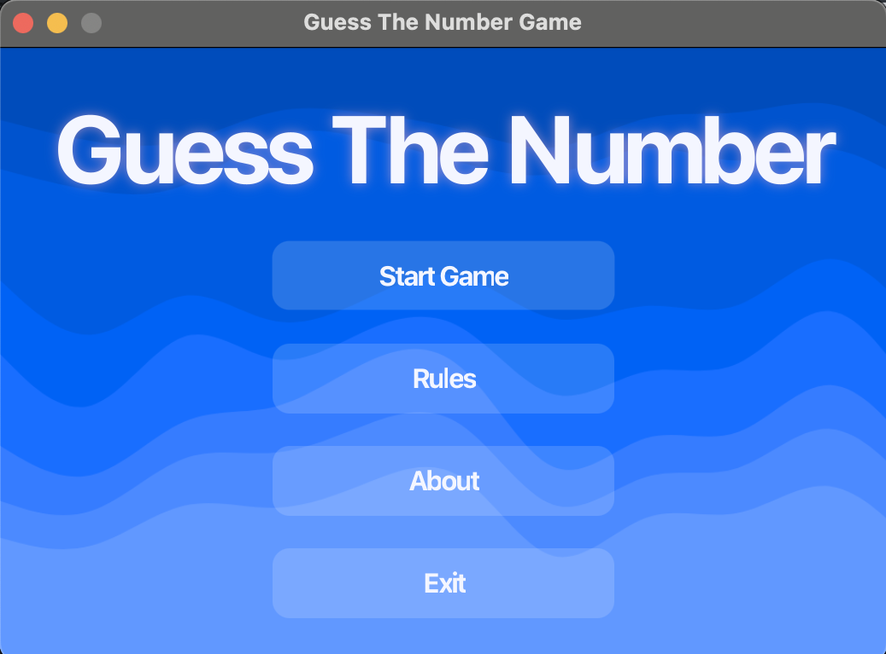
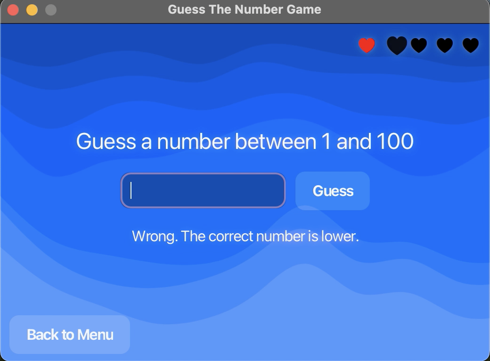
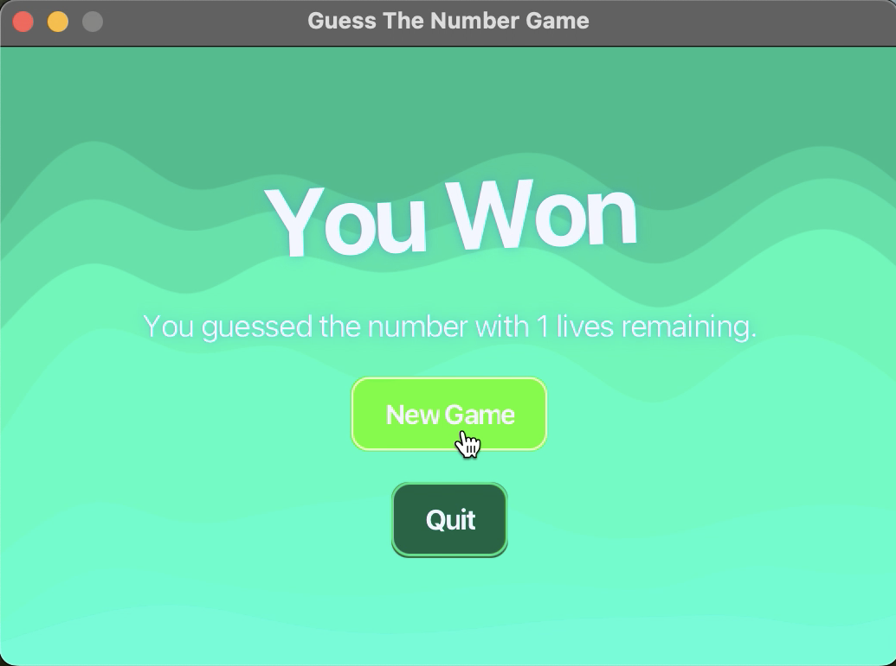
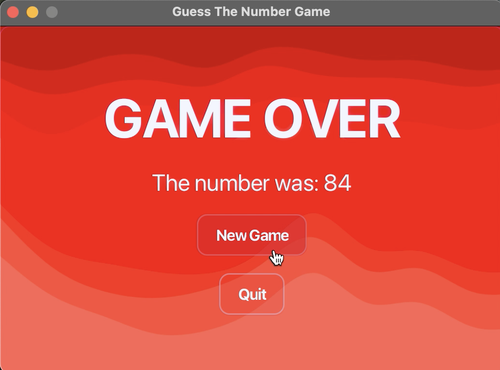

# Guess The Number

A simple desktop game built with **Java 21** and **JavaFX**.

---

## Gameplay

You have **5 lives** to guess a random number between **1 and 100**.

After each wrong guess:

- You lose a life
- You receive a hint: **higher** or **lower**

The game ends when:

- You guess the number → **Win**
- You run out of lives → **Game Over**

---

## Version 2.0.0 — UI Redesign

This version introduces a complete visual overhaul:

- Coeherent colouring
- Background illustrations per screen
- Improved typography and layout hierarchy
- Enhanced win animations
- Refined feedback alignment and readability
- Cleaner CSS architecture

---

## Screenshots

### Main Menu



### Game Screen



### Win Screen



### Game Over Screen



---

## Features

- Random number generation
- State-driven game engine
- Lives system with animated hearts
- Win & Game Over screens
- Keyboard + button input
- Styled UI with CSS
- Scene transitions & animations
- Cross-platform installers

---

## Tech Stack

- **Java 21**
- **JavaFX**
- **Maven**
- **GitHub Actions**
- **jlink + jpackage**

---

## Download

Download the latest version:

**[Latest Release](https://github.com/ritaamaralsilva/guess-the-number/releases/latest)**

Available installers:

- macOS (Apple Silicon (M-series)) – .dmg
- macOS (Intel) – .dmg
- Windows (.msi)
- Linux (.deb / .rpm)

---

## ▶ Run Locally

```bash
mvn clean javafx:run
```
